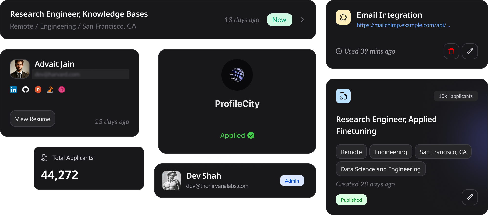

<p align="center">
  <a href="https://github.com/profilecity/vidur">
   
  </a>

<h2 align="center">Vidur (powered by ProfileCity)</h3>

<p align="center">
    Host career sites, streamline candidate shortlisting, manage recruiting workflows, build and integrate 3rd-party hiring plugins, all while scaling effortlessly with open-source.
    <br /><br />
    <a href="https://discord.gg/9ms5uYF8xF">Discord</a>
    ·
    <a href="https://www.profilecity.xyz/vidur">Website</a>
    ·
    <a href="https://github.com/profilecity/vidur/issues">Issues</a>
  </p>
</p>

<p align="center">
  <a href="https://github.com/profilecity/vidur/"></a>
   <a href="https://x.com/profilecityhq"></a>
   <a href="https://discord.com/invite/cRaukv9dJ2"></a>
   <a href="https://www.linkedin.com/company/profilecity"></a>
   <a href="https://www.producthunt.com/products/vidur"></a>
</p>

Vidur is an open-source, modern recruiting software designed to make hiring faster, smarter, better, and more customizable. The software scales with the company's hiring needs. You can start with a simple career site and expand to creating custom recruiting workflows using plugins as modular building blocks.



This design ensures transparency, efficiency, and ease of use. With Vidur v1.0, you can -

1. Create and manage your own career sites to showcase job openings and attract candidates.
2. Add and build plugins to extend Vidur’s functionality and connect with other tools you use.
3. Allow candidates to apply for jobs with just one click, simplifying the application process.
4. Easily manage candidate profiles and shortlist the most suitable candidates for each position.
5. Add as many team members as needed without restrictions, so everyone can collaborate effectively.

## How Vidur Works

- **Free and Open-Source:** Vidur is free to use with the option to self-host or opt for managed services.
- **Customizable Plugins:** Create unlimited plugins and extensions tailored to your hiring needs.
- **Unlimited Team Members:** Invite your entire team with no additional costs.
- **Zero-Cost Deployment:** Deploy Vidur on your servers at zero cost. To activate the career site for production, visit [here](https://tally.so/r/nGD0GO).

You can also schedule a quick call with the team [here](https://calendly.com/0xdevshah).

## Getting Started

To get up and running with Vidur, follow these steps:

### Local Setup

1. **Ensure PostgreSQL is Installed** Make sure you have a PostgreSQL instance running. If you need help setting it up, refer to the [PostgreSQL documentation](https://www.postgresql.org/docs/).
2. **Clone the Repository**

```bash
git clone https://github.com/your-repo/vidur.git
cd vidur
```

3. **Install Dependencies** Install Yarn if you haven't already:

```bash
npm i -g yarn

# Install all project dependencies
yarn
```

4. **Configure Environment Variables** Create a `.env` file from the example template:

```bash
cp .env.example .env

# Fill in the required fields in the .env file. Do not change the PORT value.
```

5. **Set Up the Database** Apply the database schema:

```bash
yarn migration:apply
```

6.  **Start the Development Server** Run the development server:

```bash
yarn dev
```

### Using Docker

If you prefer using Docker, you can quickly set up Vidur with Docker Compose:

```bash
docker compose up
```

This command starts both the `db` and `app` services using the `dev` profile, running PostgreSQL as `database` and the app as `vidur_app`.

You can also pull the latest Docker image from [here](https://hub.docker.com/r/profilecity/vidur/tags).

## Contributing

We welcome contributions from the community! Check out our [contribution guide](./CONTRIBUTING.md) to get involved and help us make Vidur even better.

## Contributors

Vidur wouldn’t be possible without the support and contributions from our amazing community. A special thank you to all our contributors who have helped make Vidur better. You can find a list of our contributors -

<!-- ALL-CONTRIBUTORS-LIST:START - Do not remove or modify this section -->
<!-- prettier-ignore-start -->
<!-- markdownlint-disable -->

<!-- markdownlint-restore -->
<!-- prettier-ignore-end -->

<!-- ALL-CONTRIBUTORS-LIST:END -->

## Roadmap

We believe in transparency and collaboration, which is why we've open-sourced our [Roadmap](https://github.com/orgs/profilecity/projects/5). You can view our planned features, ongoing projects, and future updates on our Roadmap. We welcome feedback and suggestions from the community to help shape the future of Vidur.

## Release Notes

Stay up-to-date with the latest improvements, bug fixes, and new features by checking our [Release Notes](https://github.com/profilecity/vidur/releases). Each release note provides detailed information about the changes and updates made in every version of Vidur.

## Staying ahead

Star Vidur on GitHub and set the repo on a watch to be instantly notified of new releases.


## Security disclosure

To protect your privacy, please avoid posting security issues on GitHub. Instead, send your questions to teams@profilecity.xyz and we will provide you with a more detailed answer.

## Contact

For any questions or support inquiries, please contact us at teams@profilecity.xyz, raise a query on the Discord server or create an issue on our GitHub repository.
